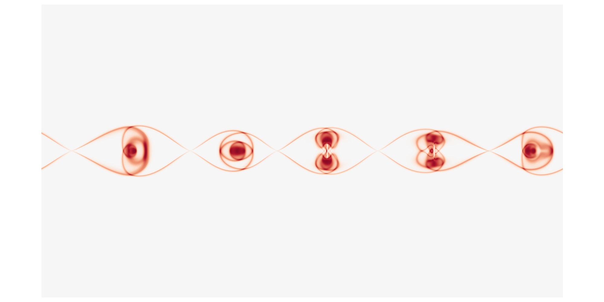

# Accelerated Python for CFD

**Jamie Quinn**

University College London / University of Glasgow

# Melvin.py

A pseudo-spectral, GPU-accelerated framework for numerically solving 2D problems in fluids.

# MHD tearing instability



# Thermohaline staircase formation


# Why Python?

- Easy prototyping
- Fast iteration cycle
- Collective good practice
- Access to accelerated libraries
- Students *want* to learn & use Python

. . .

It's a great language for prototyping research codes & teaching

# Easy prototyping

- spectral/FDM spatial discretisation
- periodic/Dirichlet boundary conditions
- 2nd/4th order spatial derivatives for nonlinear advection operator
- 2nd/4th order Adams-Bashforth time integration
- Implicit handling of diffusion operator

. . .

Designed to be **extensible**

# Fast iteration cycle

1. Jupyter notebook
2. Collection of scripts
3. Fully-fledged Python package

. . .

Permits refinement of **methods** and **interfaces**

# Collective good practices

- Version control with git & Github
- Parameterisation with JSON
- Community contributions through Github
- Automated with Github Actions
  - unit testing with pytest
  - static analysis with Flake8 and Black

# Acceleration: CuPy

```
#import numpy as np
import cupy as np

spectral_arr = np.fft(physical_arr)
```

- GPU-accelerated Numpy
- Access to multi-GPU
- Easy integration with other libraries
- Drop-in alternatives like Jax offer machine learning
- Can profile using NVIDIA's Nsight

# Lessons learned

- Non-compiled = unsafe -> static analysis!!
- Non-compiled = slow -> offload as much as possible
- Speed is "good enough"
- Flexibility is worth it
- Numpy -> CuPY -> Numba -> CUDA python

# Accelerated C++?

- OpenMP, OpenACC, `std::par`, CUDA
- C++20 nearly as simple as Python?
- Melvin.py is 1.5x runtime of C++ CUDA version

# Julia?

- Offers impressive performance with Pythonic ease
- Still young
- Few opportunities beyond HPC

#

Python is rarely as fast as Fortran & C++

. . .

but its flexibility makes it an ideal language for

- prototyping GPU-accelerated CFD codes
- teaching CFD

# Thanks! Questions?

